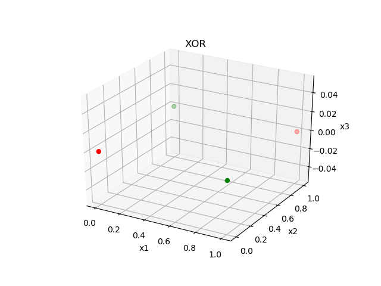
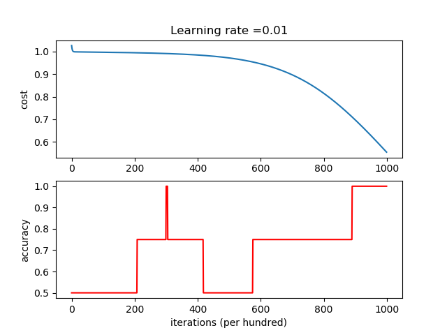
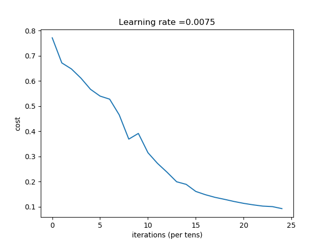
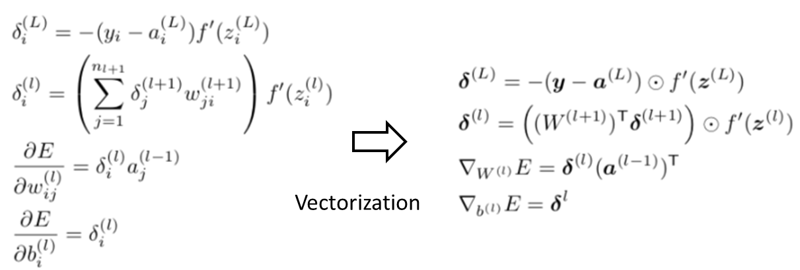
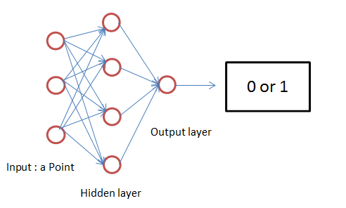

# Back Propagation in neural network
## 0 How To Run
```
# run the XOR problem
python bp.py --xor

# run the Linear Separable problem
python bp.py --linears

# run the NonLinear Separable problem
python bp.py --nonlinears

# run the image classification problem
python bp.py --imagecls
```
## 1 My Work
$\quad$This work is based on CS230 C1W4 in Standford University, I have done the homework for image classfication which is task4. And I also adjusted the network and tried the network on other 3 problems.
### 1.1 Task1:XOR problem
$\quad$A two layer model was used to solve the problem, after 90000 epochs, four points were classfied. Here are dataset and result:
<div align="center">


</div> 

### 1.2 Space points classification(linear separable)

$\quad$Given a dataset  containing two types of points randomly generated, which is labeled by 1 or labeled by 0. The task is to classify them. I designed a one-hidden-layer neural network. In this network, the input dimension is 3, the next is 4, and the last is 2. In another word, one point that has three dimensions is inputted in the network, then it is mapped into four dimension space. Intuitionally, it's easier to classify them. And the output layer size is two, which outputs 01(label 1) or 10(label 0).Here are dataset and result:

<div align="center">


</div> 

### 1.3 Space points classfication(linear separable)
$\quad$Both two layer and multi-layer MLP I implemented worked not well on the problem,here are the dataset and result:   
<div align="center">


</div>    

### 1.4 Image classfication
$\quad$You are given a dataset ("data.h5") containing:
- a training set of m_train images labeled as cat (y=1) or non-cat (y=0)
- a test set of m_test images labeled as cat or non-cat
- each image is of shape (num_px, num_px, 3) where 3 is for the 3 channels (RGB). Thus, each image is square (height = num_px) and (width = num_px).

$\quad$A multi-layer MLP that can correctly classify pictures as cat or non-cat is constructed.

<div align="center">


</div>   

## 2.Implementation
### 2.1 Vectorization
<div align="center">

</div>   

### 2.2 Batch Learning
$\quad$Due to memory limit, usually we can't take the total data into the model. Or noisy data happens when using online learning[1]. Mini-batch is preferred when train a neural network. There are some tips in batch size selecting[2]:(1)A good default for batch size might be 32 (2)It is a good idea to review learning curves of model validation error against training time with different batch sizes when tuning the batch size.(3)Tune batch size and learning rate after tuning all other hyperparameters
### 2.3 API
$\quad$There are some basic functions I have implemented for the backpropagation algorithm. They are as follow:

| function | description | args | return |
|----------------------------------------------------------------|-------------------------------------------------------------------------------------|----------------------------------------------------------------------------------------------------------------------------------|----------------------------------------------------------|
| `sigmoid(Z)`                                                   | sigmoid function                                                                    | Z:a scalar, vector, or matrix                                                                                                    |                                                          |
| `forward(W,X,b)`                                               | forward for the **single**  layer                                                   | W:   the coefficient matrix of the network   X:   input point with three dimensions:x1,x2,x3  b:   bias                          | Z,A                                                      |
| `compute_local_gradient_output(y,A)`                           | compute $\delta$ with respect to output layer                                       | A: real output of j y: desired output of j                                                                                       | delta: local gradient of neural j when j is output layer |
| `compute_local_gradient_hidden(A,W,delta2)`                    | compute $\delta$ with respect to hidden layer                                       | A: previous layer's output W: previous layer's weights delta2                                                                    | delta: local gradient of neural j when j is hidden layer |
| `update_parameters(parameters,delta,cache,learning_rate=0.01)` | according to the forward and backward computation,update all weights in the network | parameters: python dictionary containing:W1,b1,W2,b2 delta:python tuple containing:delta1,delta2 cache:python dick learning_rate | parameters                                                  

There are also many little functions I implemented which will not be shown here due to limited space.


## 3. Model
### 3.1 Two layer neural network


### 3.2 Multi-layer neural network(MLP)


## Reference
[1] [Standford CS230 Notes](https://stanford.edu/~shervine/teaching/cs-230/cheatsheet-deep-learning-tips-and-tricks)    
[2] https://machinelearningmastery.com/gentle-introduction-mini-batch-gradient-descent-configure-batch-size/


<script type="text/javascript" src="http://cdn.mathjax.org/mathjax/latest/MathJax.js?config=TeX-AMS-MML_HTMLorMML"></script>
<script type="text/x-mathjax-config">
    MathJax.Hub.Config({ tex2jax: {inlineMath: [['$', '$']]}, messageStyle: "none" });
</script>